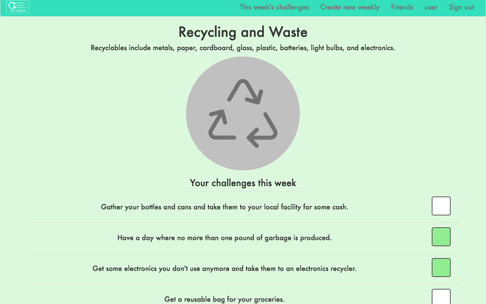

# The Greenest Badges Ever

---

[Heroku](http://the-greenest-badges.herokuapp.com)

The MEAN stack app goes green by having users complete a set of challenges every week and earn Internet badges.

#### Technologies Used

| Item       | Description     |
|:------------:|:---------------|
| MongoDB    | NoSQL database with JSON-like documents with dynamic schemas |
| Express.js | Server framework for Node.js          |
| AngularJS  | Front-end JavaScript framework        |
| Angular ui-router | Renders HTML templates and makes this website a single-page app |
| Node.js    | Back-end JavaScript environment       |
| Mongoose   | The middleman between Node and MongoDB |
| Bootstrap  | CSS library                           |
| jwt        | User authentication and authorization |
| bcrypt     | Encrypts user passwords               |

#### How to Use

Create an account.  You'll be redirected to the current weekly challenge page.  Do the challenges then check off their boxes when you're done.  When all the challenges are complete hit the Finish button to receive your badge.

Users can create new badges with any number of challenges from the  Create Badge button in the navbar.

There's also a basic friends system.  Submit a username of a person you want to be friends with.  That person accepts the friend request, then both of you will be added to each others' friends list.  Friends have no function at this moment but features like leaderboards, progress checking, and private messages will be added in the next weeks.

#### Other need to knows

For demonstration purposes weeklies will rotate every two minutes.  Users currently will lose their progress when a new weekly is rotated in.

#### Development Process

I started with the backend first since it determines what's shown in the front end.

Implementation of jwt was first.  Even when I copied files from a demo done an earlier week authentication took longer than expected to get done.

Next were the core features of the app.  First I made a single set of weekly challenges to be shown when the user logs in.  Users should be able to save their progress so I saved the checklist to the database every time a checkbox was clicked.

At the moment users were sharing the one single copy of the weekly.  Users needed to be working only on their own copies of the weekly.  I updated the mongoose schemas and had the database send users copies of the weekly when they logged in.  If they already had a copy it would not be overwritten.

I needed to find a way to make the weeklies rotate after some period of time.  I couldn't use `setInterval` because the server only runs code when it receives a request.  Instead I had the server check `Date.now()` whenever the weekly page was requested.  Using `Date.now()` I put its value in a formula I wrote to convert it to an index of the weeklies array in the Weekly model.  The server gets that particular weekly to send back to the user.  Currently weeklies will update every 2 minutes for demonstration purposes.

